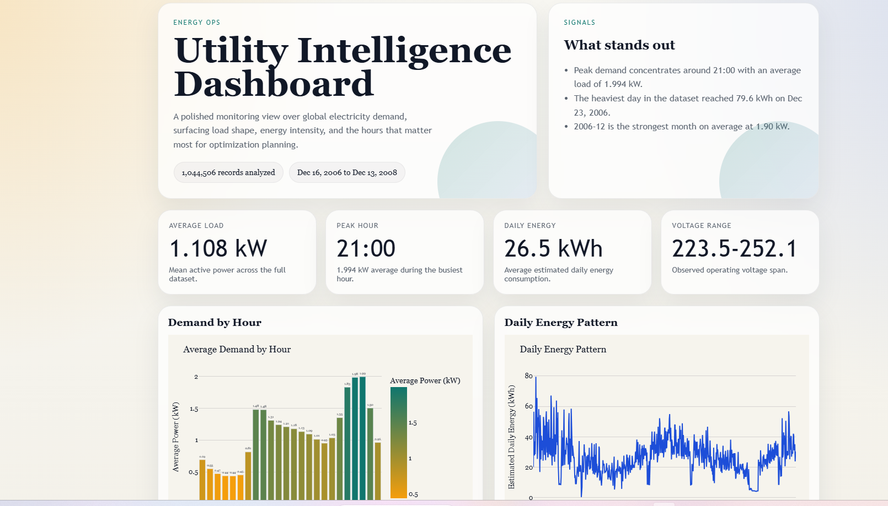

# ⚡ Utility Data Analysis & Energy Optimization Tool

Built using Python, SQL, and Flask to simulate real-world utility data analysis workflows.

---

## 📊 Overview

This project analyzes global electricity consumption data to identify usage patterns, peak demand periods, and potential optimization opportunities.

It demonstrates a complete data workflow:
- Data cleaning
- Data analysis
- Database integration
- Web-based dashboard visualization

---

## 🛠️ Technologies Used

- Python (Pandas, Matplotlib)
- SQL (SQLite)
- Flask (Web Application)

---

## ⚙️ Features

- Data cleaning and preprocessing pipeline  
- Time-based energy usage analysis  
- SQL database integration for querying  
- Interactive dashboard displaying key metrics and charts  

---

## 📸 Dashboard Preview

Below is a screenshot of the dashboard displaying energy insights:



---

## 🔍 Key Insights

- Identified peak electricity usage hours  
- Analyzed daily and monthly consumption trends  
- Calculated average and total energy usage  

---

## 🏢 Real-World Application

This type of analysis can help utility companies:

- Predict peak demand periods  
- Optimize energy distribution  
- Improve infrastructure planning  
- Recommend cost-saving strategies to customers  

---

## 🚀 How to Run

### 1. Install dependencies
```bash
pip install -r requirements.txt
```

### 2. Run data pipeline
```bash
python src/data_cleaning.py
python src/data_analysis.py
python src/database.py
```

### 3. Run the web app
```bash
python app/app.py
```

Then open:

```
http://127.0.0.1:5000
```

---

## 📁 Project Structure

```
utility-analysis-project/
│
├── app/
│   ├── templates/
│   │   └── dashboard.html
│   └── app.py
│
├── data/
│   ├── cleaned_data.csv
│   ├── raw_data.csv
│   └── utility.db
│
├── outputs/
│   ├── dashboard.png
│   ├── charts/
│   │   ├── daily_usage.png
│   │   ├── monthly_usage.png
│   │   └── peak_usage.png
│   └── .gitkeep
│
├── src/
│   ├── data_analysis.py
│   ├── data_cleaning.py
│   └── database.py
│
├── .gitignore
├── README.md
└── requirements.txt
```

---

## 📌 Future Improvements

- Add interactive filtering (date ranges, usage categories)  
- Enhance dashboard UI/UX  
- Implement predictive analytics for demand forecasting  

---

## 👨‍💻 Author

Built as part of a hands-on data analytics and software development learning project.